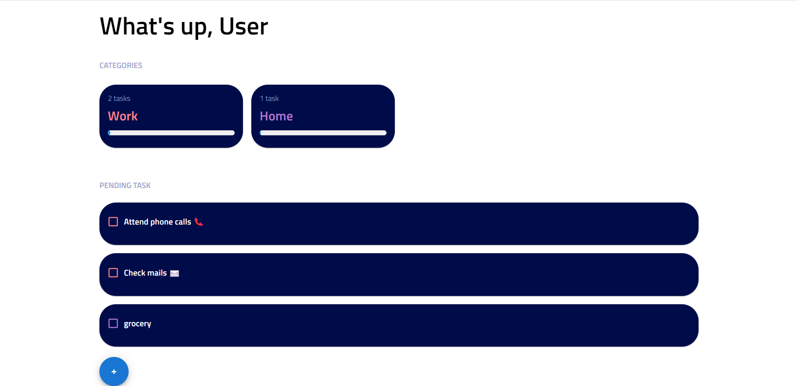
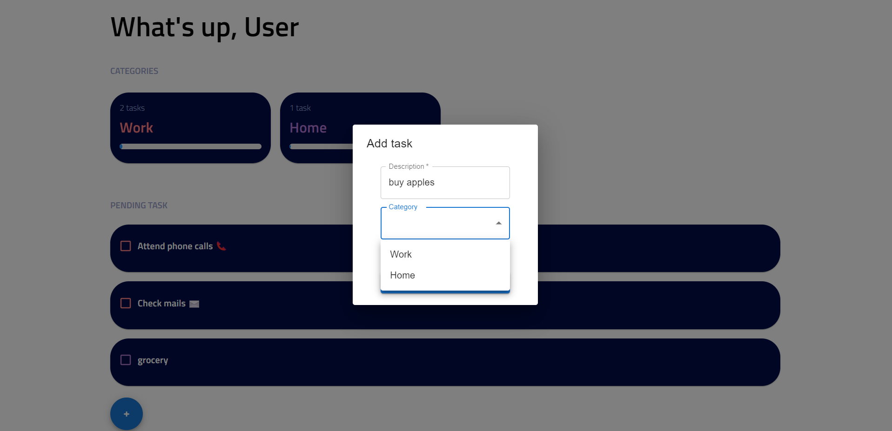
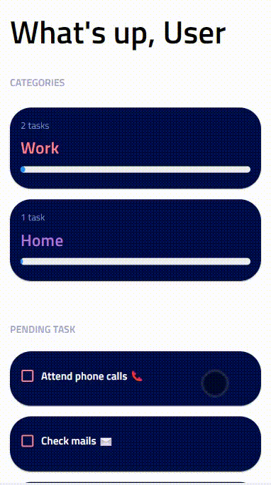

# FacereAlbum (ToDo list)

A Webapp build using Reactjs and Material ui  
Customised todo list which gives you the funtionality to add task based on category you choose (or create a new one)

Features this app provides:
1. Create a category wise listing for your tasks.
2. Unique color schemes for all the tasks in a particular category
3. Progress bars showing pending tasks under a category
4. Mark tasks as done 

A very unique design for managing your upcoming task which helps you to keep track of them.
Different color schemes for each category to make the user interface lively and appealing :)

### App homepage (tasks listing)

### Add task 
choose between adding a new category or selecting an existing one

### Mobile responsive and app walkthrough

  

